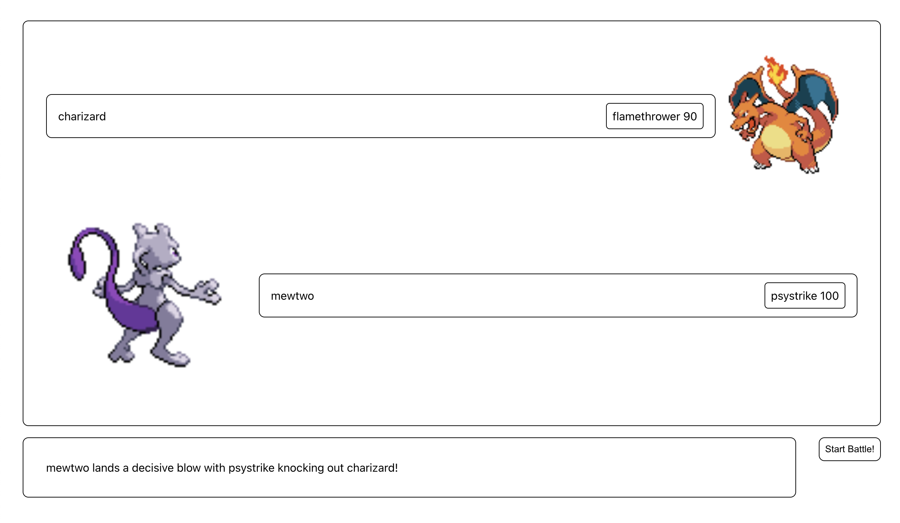

# React Interview App

This is a Pokemon battle simulator with the following functionality:
- randomly selects 2 pokemon with random moves
- after pressing `Start battle` button, battle result displays
- to start a new game refresh page

## Usage

### Prerequisites

Ensure that you have [Node.js](https://nodejs.org/en/download/) installed on your machine.

### Installation

Follow the steps below to set up the project on your local machine:
1. Update npm to the latest version: Run `npm install -g npm`
2. Clone this repository: Run `git clone <repository_url>`
3. Navigate into the cloned repository: Run `cd <repository_name>`
4. Install the project dependencies: Run `npm install`
5. Start the project: Run `npm start`
6. View the running application: Load `http://localhost:3000/` in your web browser

### Tests

To run tests use `npm run test`.

## Used libraries

- tanstack/react-query 
  - simplifies data fetching, provides caching and states like loading, errors
- lodash.random
- msw to mock API in tests

## TODO

- resolve todos in code
- fix jest config, so that requests in tests can be mocked
- add sass or less for easier/better work with css
 